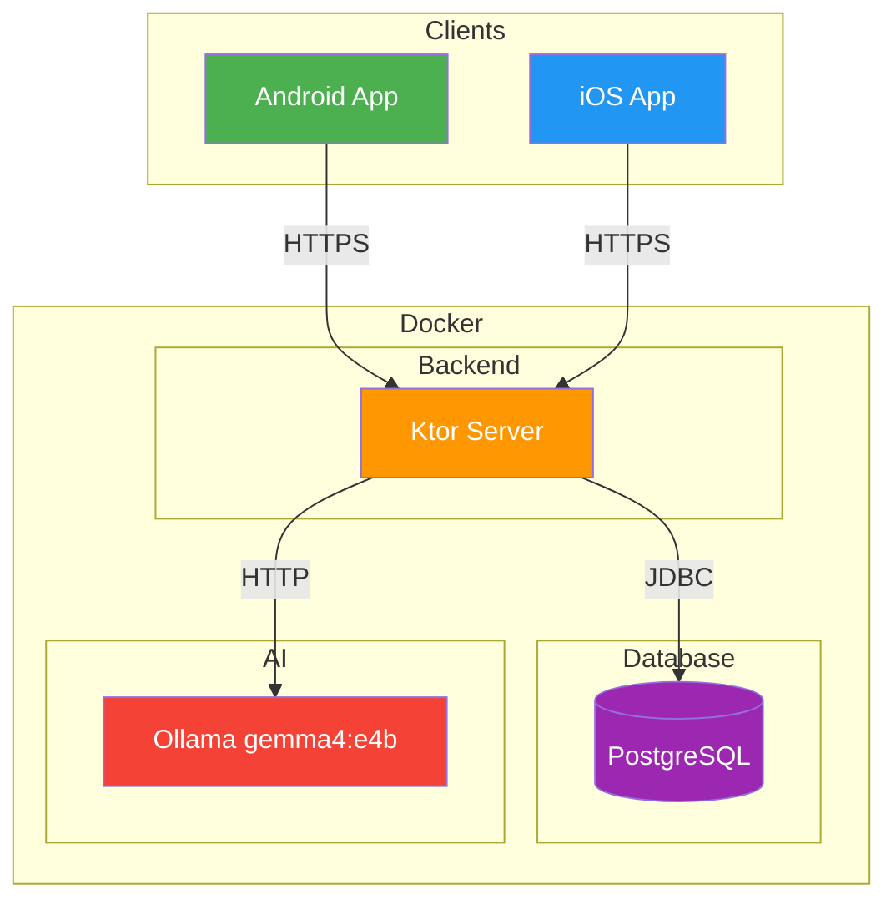
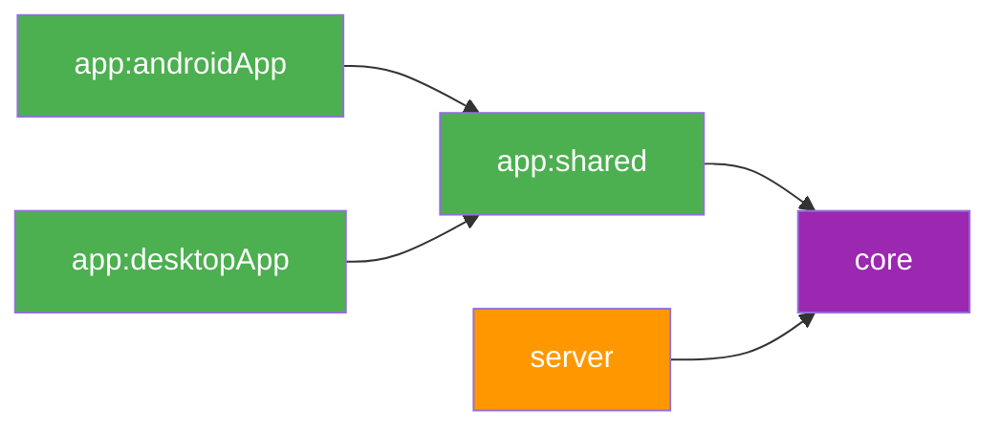
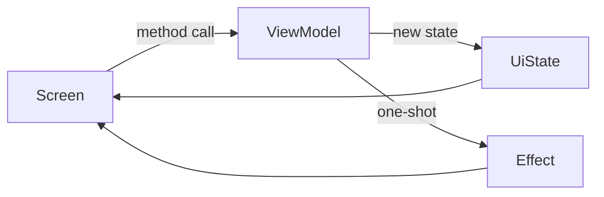
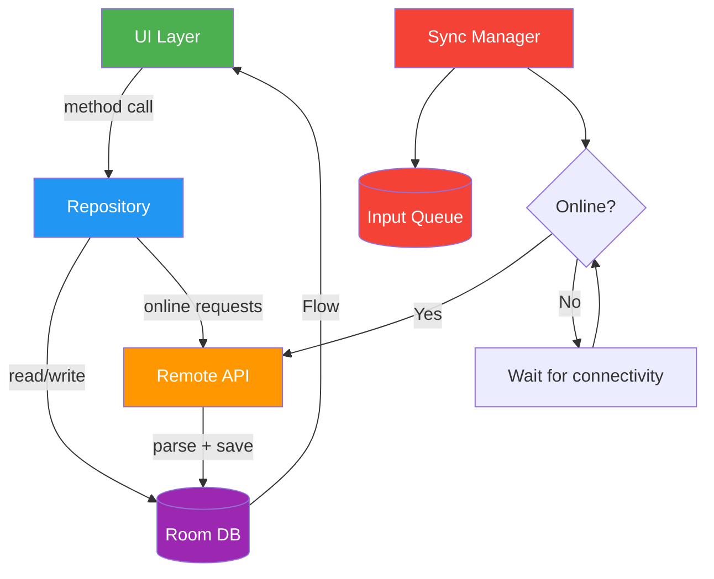
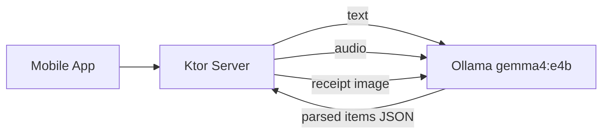
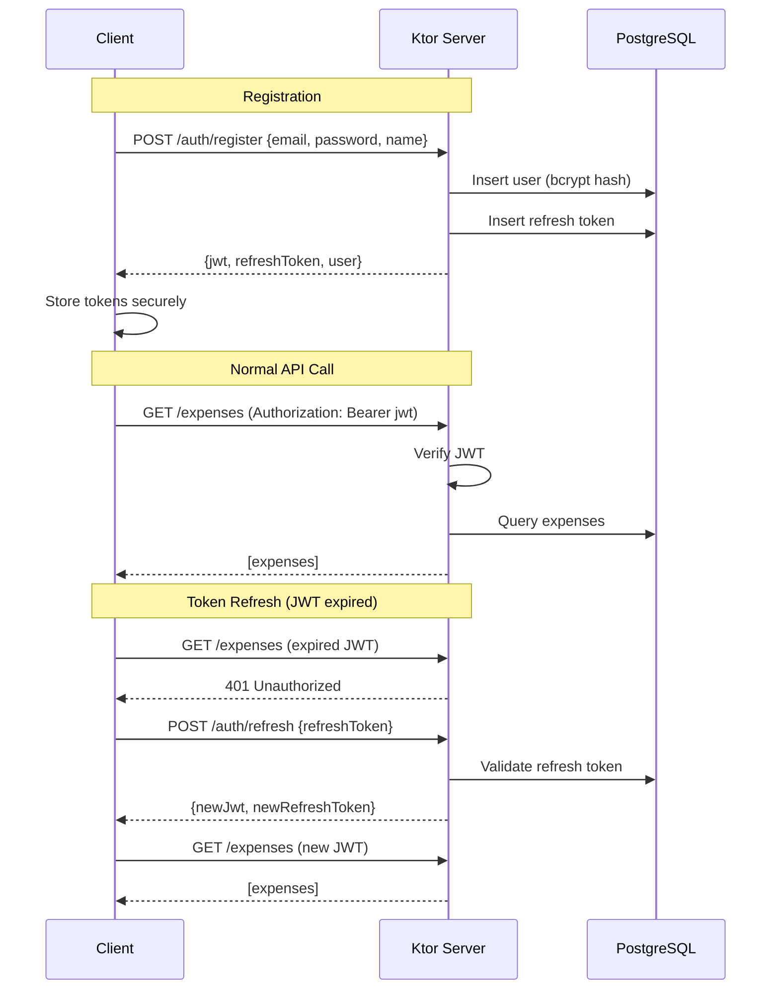
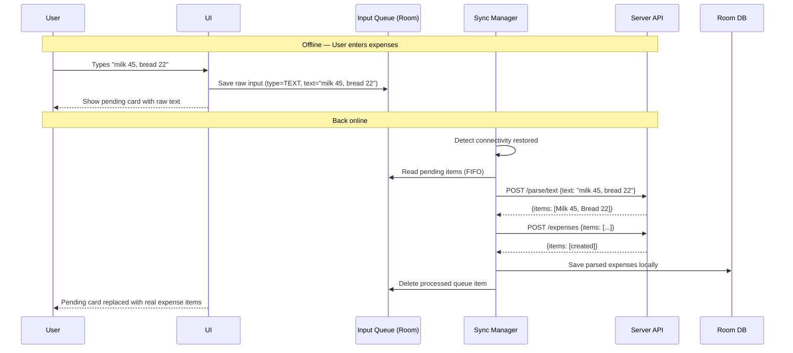
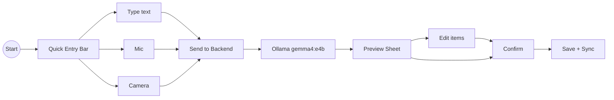
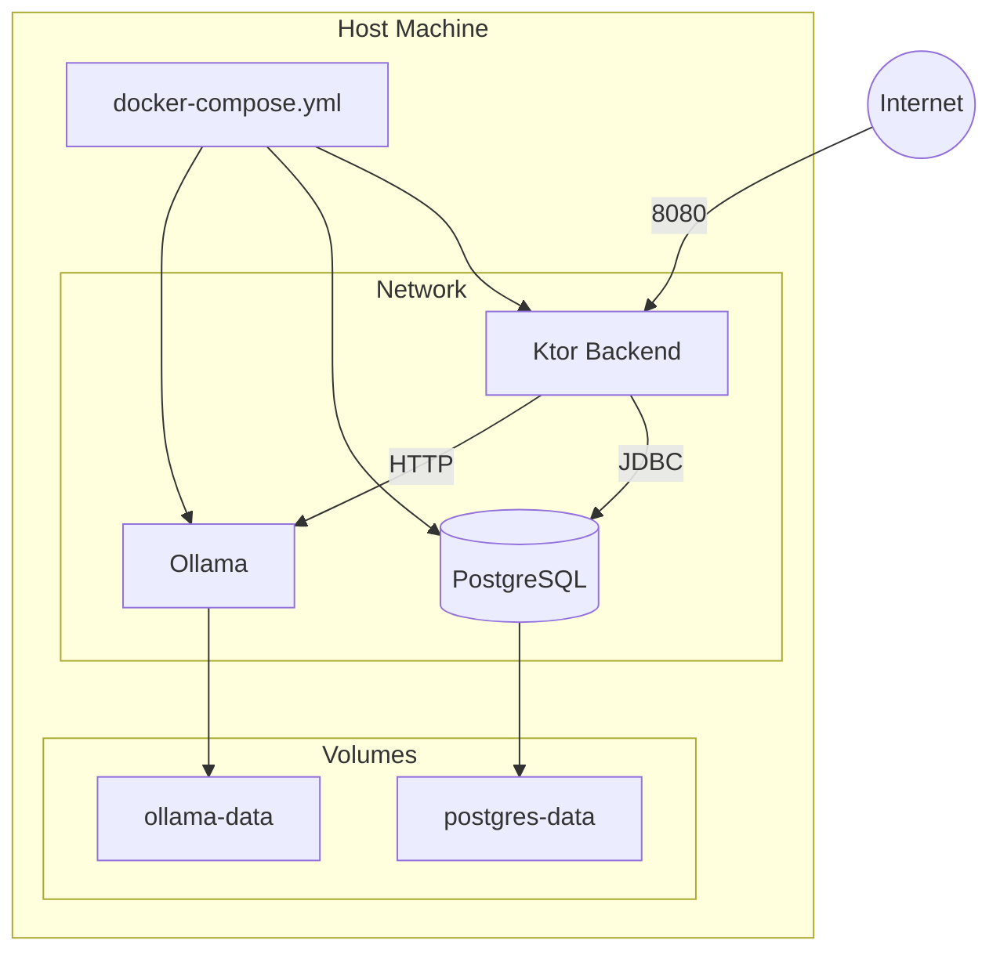

# Architecture

## System Architecture




## Monorepo Module Structure

```
skilky-money-tracker/
├── build-logic/                    # Convention plugins (composite build)
├── core/                           # :core — DTOs, enums, API routes, validation (client + server)
├── server/                         # :server — Ktor backend
├── app/
│   ├── shared/                     # :app:shared — CMP UI (Android library + iOS framework)
│   ├── androidApp/                 # :app:androidApp — Android application
│   ├── desktopApp/                 # :app:desktopApp — Desktop (Hot Reload sandbox)
│   └── iosApp/                     # Xcode iOS host (not a Gradle module)
├── docker/                         # Docker Compose + .env
├── gradle/libs.versions.toml       # Version catalog
├── .github/workflows/              # CI/CD
└── settings.gradle.kts
```

### Module Dependency Graph




### Module details

#### `:core`

- Dependencies: kotlinx-serialization, kotlinx-datetime.
- Contents: request/response DTOs, enums (`Currency`, `InputType`, `ParseModality`, `TrendGranularity`), `ApiRoutes` path constants, the `ApiErrorResponse` envelope, default-category data and translations.
- Targets: commonMain only, pure Kotlin.
- Purpose: the API contract that `:server` and `:app:shared` both import, so the two cannot drift.

#### `:server`

- Dependencies: `:core`, Ktor Server, Exposed, HikariCP, Koin, the PostgreSQL driver.
- Targets: JVM only.
- Purpose: the backend API and AI orchestration.

#### `:app:shared`

- Dependencies today: `:core`, Compose Multiplatform, lifecycle-viewmodel.
- Targets: androidMain, iosMain, with a jvmMain entry for desktop hot reload.
- Purpose: the shared client UI, built as an Android library and an iOS framework. The networking, local-storage, and DI layers described under Client Architecture are the planned design; this module currently holds Compose scaffolding only.

#### `:app:androidApp` and `:app:desktopApp`

- Thin entry points that host `:app:shared`. The desktop app exists for Compose Hot Reload while editing shared UI.

#### `:build-logic`

- Convention plugins (`skilky.kotlin-jvm`, `skilky.kotlin-multiplatform`, `skilky.android-app`, `skilky.detekt`, `skilky.spotless`) applied across the other modules.

---

## Client Architecture

The client is not built yet. Per `docs/implementation-phases.md` the backend is
through Phase 7; `:app:shared` still holds the Compose Multiplatform template.
This section is the intended design, not the current state.

### MVVM+ pattern

Every screen follows unidirectional data flow: **user action → ViewModel method → new state → UI**.




Each feature screen defines two types and one ViewModel:

- **UiState** — immutable `data class` holding all rendered state (`isSubmitting`, `items`, `error`, ...).
- **Effect** — `sealed interface` for one-shot signals the screen consumes once (`NavigateToHome`, `ShowSnackbar`, ...).
- **ViewModel** — exposes `state: StateFlow<UiState>` and `effects: Flow<Effect>` (backed by a `Channel`). User actions are public methods, named `onEmailChange(value)`, `onSubmit()`, `onSignOut()`, etc. The stateful screen wires those as method references into the stateless `*ScreenContent`, which is what `@Preview` and tests render.

We considered a strict MVI variant with a `sealed interface Intent` and a single `onIntent(intent)` dispatcher. It paid for itself only with event replay, middleware, or a centralized reducer, none of which are on the roadmap. Direct methods are navigable from screen to handler, refactorable by the IDE, and read like ordinary Kotlin.

### Package Structure

```
app/shared/src/commonMain/kotlin/com/vstorchevyi/skilky/
├── App.kt                          # Root composable, theme, nav host
├── di/                              # Koin modules
├── navigation/                      # NavHost, Screen sealed class
├── ui/
│   ├── theme/                       # Material 3 theme
│   ├── screens/                     # Feature screens (*Screen + *ScreenContent + ViewModel + UiState + Effect)
│   │   ├── auth/
│   │   ├── home/
│   │   ├── input/
│   │   ├── expenses/
│   │   ├── analytics/
│   │   ├── categories/
│   │   └── settings/
│   └── components/                  # Reusable composables
├── data/
│   ├── local/                       # Room database, DAOs, entities
│   ├── remote/                      # Ktor client, API services, token storage
│   ├── repository/                  # Data access layer
│   └── sync/                        # Offline input queue + sync manager
└── util/                            # Platform abstractions
```

### Client Data Flow




### Repository Data Strategies

Repositories coordinate between local (Room) and remote (Ktor) data sources:


| Strategy         | How it works                                                            | Used for                   |
| ---------------- | ----------------------------------------------------------------------- | -------------------------- |
| **networkFirst** | Fetch from server → cache in Room → fallback to Room on network failure | Expenses, analytics        |
| **cacheFirst**   | Return Room data immediately → refresh from server in background        | Categories (rarely change) |
| **localOnly**    | Read/write Room directly, enqueue sync                                  | Offline input queue        |


### Error Handling

Custom exception hierarchy for networking:

```
NetworkException (sealed)
├── Unauthorized (401)     → trigger token refresh or redirect to login
├── Forbidden (403)        → show permission error
├── NotFound (404)         → show "not found" state
├── ServerError (5xx)      → show generic server error, allow retry
├── NetworkUnavailable     → show offline state
└── Timeout                → show timeout error, allow retry
```

API calls are wrapped in `AppResult<T>` (sealed class in `:shared:core`):

- `AppResult.Success<T>` — contains data
- `AppResult.Error` — contains `NetworkException`

### Key Patterns

- **Architecture:** MVVM+. Screens call methods on the ViewModel, observe `StateFlow<UiState>`, and collect a `Flow<Effect>` for navigation and snackbars.
- **Navigation:** Official JetBrains Navigation Compose with type-safe @Serializable routes
- **DI:** Koin with compose-viewmodel integration (`koinViewModel()`)
- **Online flow:** Input → server parses → preview → user confirms → save to Room + server
- **Offline flow:** Input → raw data saved to InputQueue → when online: server parses → auto-save (no preview backlog)
- **Dedup:** `clientId` (UUID) on `POST /expenses` prevents duplicates on retry
- **Token storage:** DataStore (Preferences) — KMP-native, no expect/actual needed
- **Ktor engines:** OkHttp on Android (HTTP cache, interceptors), Darwin on iOS (URLSession, NWPath)

---

## Server Architecture

### Package Structure

```
server/src/main/kotlin/com/vstorchevyi/skilky/
├── Application.kt          # module(): installs plugins, registers routes
├── ai/                     # Ollama client, prompt templates, parsing orchestration
├── config/                 # typed AppConfig over HOCON
├── db/                     # DatabaseFactory + Exposed table definitions
├── di/                     # Koin modules
├── domain/model/           # internal record types
├── errors/                 # ApiException hierarchy
├── eval/                   # offline parse-quality eval harness
├── plugins/                # one file per Ktor plugin install
├── repository/             # suspend functions over Exposed
├── routes/                 # one file per feature group
└── security/               # password/token hashing, JWT, validators
```

### AI parsing

The server calls a self-hosted Ollama instance over HTTP. One model
(`gemma4:e4b`, set via `skilky.ai.model`) handles text, audio, and receipt
images, so there is no separate speech-to-text or vision service.



`TextParsingService` is the single orchestrator behind `/parse/text`,
`/parse/audio`, and `/parse/receipt`. It builds the prompt, calls `OllamaClient`,
and maps the model's JSON reply into `ParsedExpenseItem`s. `CachedCategoryLoader`
feeds the user's categories into the prompt as hints.

The earlier plan for an `AiParsingService` interface with swappable
implementations was dropped; there is one concrete service. A cloud-provider
adapter (Gemini, OpenAI) is tracked as Post-MVP Phase 16.

---

## Auth Flow




- JWT lives 7 days, refresh token lives 90 days
- Refresh token rotates on each use
- Password change invalidates all refresh tokens (kills all sessions)
- Same auth system for hosted and self-hosted (self-hosted users just create one account)
- JWT payload: userId, email, iat, exp

---

## Offline Input Queue

Since AI parsing happens on the server, the client can only store **raw input** (text, audio, images) when offline — not structured expenses.




- Raw input (text/audio/image) stored locally in InputQueue table
- When online: send to `/parse/*` → auto-save with AI categories → no user review backlog
- `clientId` (UUID) on `POST /expenses` ensures dedup on retries
- User can review and edit auto-saved items at their own pace
- On app launch (online): process queue + pull latest expenses from server

---

## Expense Input Flow




---

## Docker Deployment




