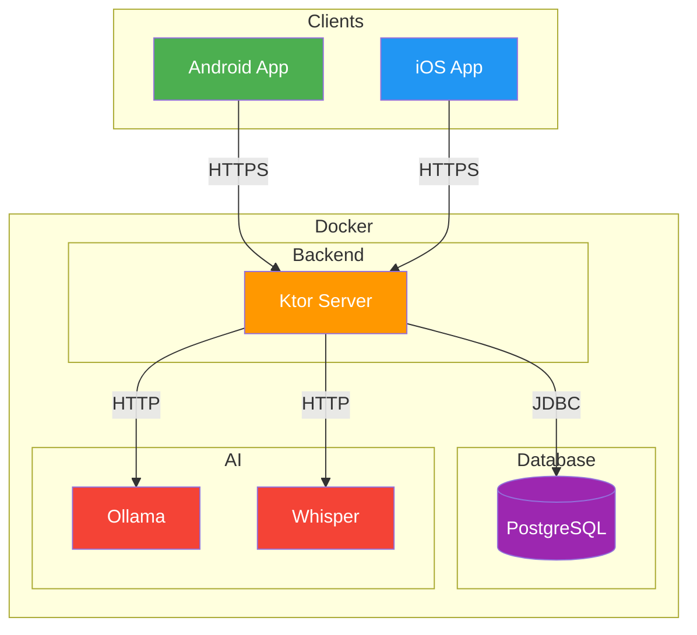
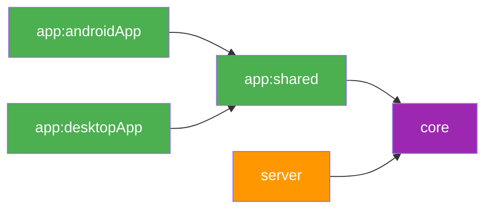
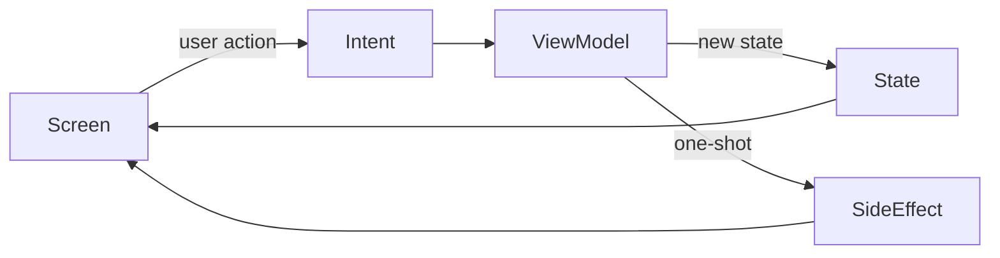
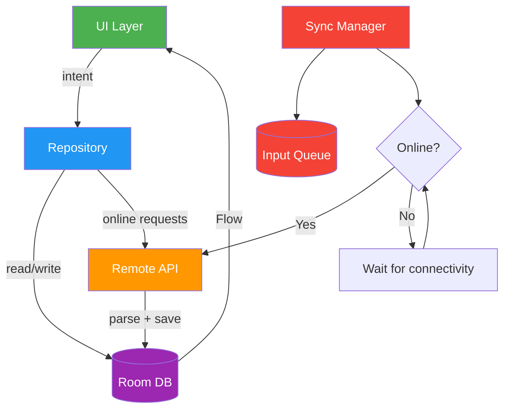
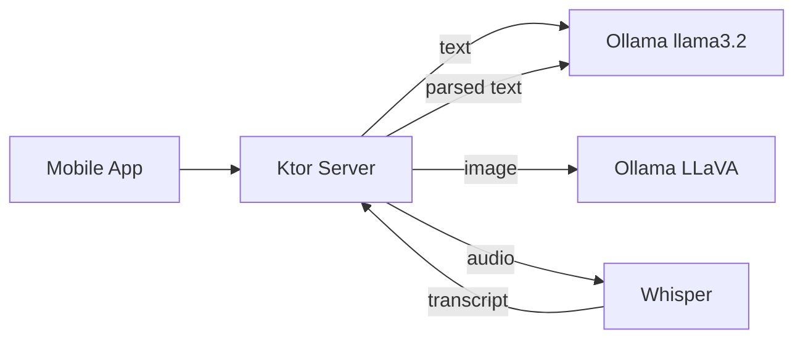
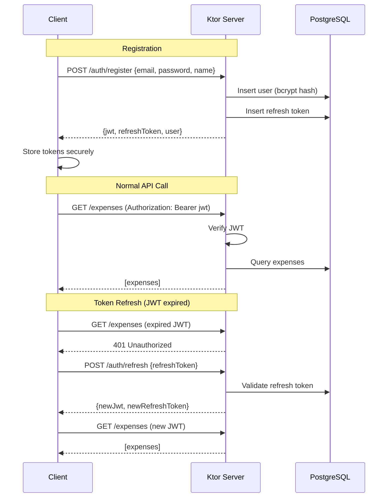
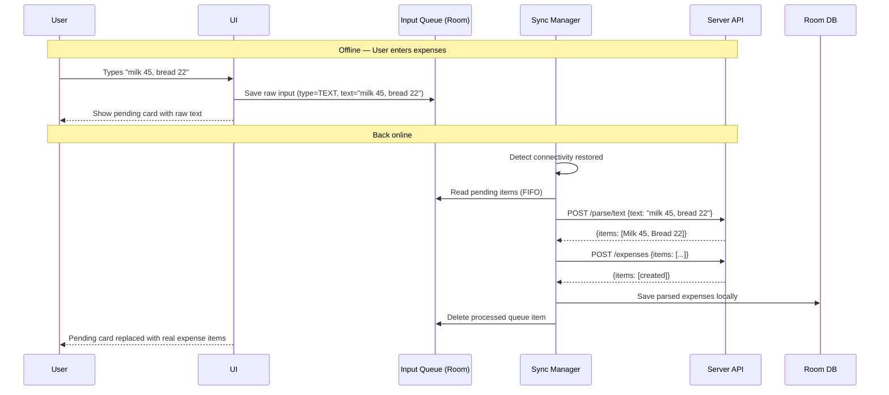
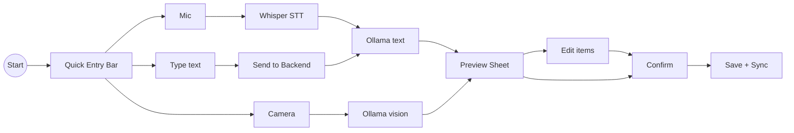
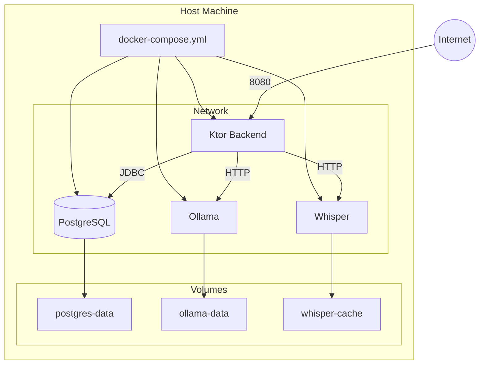

# Architecture

## System Architecture




## Monorepo Module Structure

```
skilky-money-tracker/
├── build-logic/                    # Convention plugins (composite build)
├── core/                           # :core — DTOs, enums, API routes, validation (client + server)
├── server/                         # :server — Ktor backend
├── app/
│   ├── shared/                     # :app:shared — CMP UI (Android library + iOS framework)
│   ├── androidApp/                 # :app:androidApp — Android application
│   ├── desktopApp/                 # :app:desktopApp — Desktop (Hot Reload sandbox)
│   └── iosApp/                     # Xcode iOS host (not a Gradle module)
├── docker/                         # Docker Compose + .env
├── gradle/libs.versions.toml       # Version catalog
├── .github/workflows/              # CI/CD
└── settings.gradle.kts
```

### Module Dependency Graph




### Module Details

#### :shared:models

- **Dependencies:** kotlinx-serialization, kotlinx-datetime only
- **Contents:** All DTOs (request/response), enums (Currency, InputType), ApiRoutes constants, shared validation
- **Validation:** Value classes with `require()` for domain types (e.g. `Email`, password strength rules). Shared between client and server — validate once, enforce everywhere.
- **Targets:** commonMain only (pure Kotlin, no platform code)
- **Purpose:** API contract that both client and server import — ensures they can never drift

#### :shared:core

- **Dependencies:** :shared:models, kotlinx-coroutines, kotlinx-datetime
- **Contents:** CurrencyFormatter, DateUtils, AppResult sealed class, localization StringKeys
- **Targets:** commonMain only
- **Purpose:** Business logic shared between client and server

#### :composeApp

- **Dependencies:** :shared:core, Room KMP, Ktor Client, Koin, Navigation Compose, Coil, Compose MP
- **Targets:** androidMain, iosMain
- **expect/actual:** DatabaseFactory, NetworkMonitor, AudioRecorder
- **Purpose:** The mobile app

#### :server

- **Dependencies:** :shared:core, Ktor Server, Exposed, Koin, PostgreSQL driver
- **Targets:** JVM only
- **Purpose:** Backend API + AI orchestration

---

## Client Architecture

### MVI Pattern (Model-View-Intent)

Every screen follows unidirectional data flow: **Intent → ViewModel → State → UI**.




Each feature screen defines three things:

- **State** — immutable `data class` holding all UI state (`isLoading`, `items`, `error`, etc.)
- **Intent** — `sealed interface` of all user actions (`Submit`, `Delete`, `Refresh`, etc.)
- **SideEffect** — `sealed interface` for one-shot events (`NavigateTo`, `ShowSnackbar`, etc.)

The ViewModel exposes `StateFlow<State>` and `Channel<SideEffect>`. The Screen collects state and sends intents.

### Package Structure

```
composeApp/src/commonMain/kotlin/dev/skilky/tracker/app/
├── App.kt                          # Root composable, theme, nav host
├── di/                              # Koin modules
├── navigation/                      # NavHost, Screen sealed class
├── ui/
│   ├── theme/                       # Material 3 theme
│   ├── screens/                     # Feature screens (Screen + ViewModel + State + Intent)
│   │   ├── auth/
│   │   ├── home/
│   │   ├── input/
│   │   ├── expenses/
│   │   ├── analytics/
│   │   ├── categories/
│   │   └── settings/
│   └── components/                  # Reusable composables
├── data/
│   ├── local/                       # Room database, DAOs, entities
│   ├── remote/                      # Ktor client, API services, token storage
│   ├── repository/                  # Data access layer
│   └── sync/                        # Offline input queue + sync manager
└── util/                            # Platform abstractions
```

### Client Data Flow




### Repository Data Strategies

Repositories coordinate between local (Room) and remote (Ktor) data sources:


| Strategy         | How it works                                                            | Used for                   |
| ---------------- | ----------------------------------------------------------------------- | -------------------------- |
| **networkFirst** | Fetch from server → cache in Room → fallback to Room on network failure | Expenses, analytics        |
| **cacheFirst**   | Return Room data immediately → refresh from server in background        | Categories (rarely change) |
| **localOnly**    | Read/write Room directly, enqueue sync                                  | Offline input queue        |


### Error Handling

Custom exception hierarchy for networking:

```
NetworkException (sealed)
├── Unauthorized (401)     → trigger token refresh or redirect to login
├── Forbidden (403)        → show permission error
├── NotFound (404)         → show "not found" state
├── ServerError (5xx)      → show generic server error, allow retry
├── NetworkUnavailable     → show offline state
└── Timeout                → show timeout error, allow retry
```

API calls are wrapped in `AppResult<T>` (sealed class in `:shared:core`):

- `AppResult.Success<T>` — contains data
- `AppResult.Error` — contains `NetworkException`

### Key Patterns

- **Architecture:** MVI — Intent → ViewModel → State → UI, with SideEffects for navigation/snackbars
- **Navigation:** Official JetBrains Navigation Compose with type-safe @Serializable routes
- **DI:** Koin with compose-viewmodel integration (`koinViewModel()`)
- **Online flow:** Input → server parses → preview → user confirms → save to Room + server
- **Offline flow:** Input → raw data saved to InputQueue → when online: server parses → auto-save (no preview backlog)
- **Dedup:** `clientId` (UUID) on `POST /expenses` prevents duplicates on retry
- **Token storage:** DataStore (Preferences) — KMP-native, no expect/actual needed
- **Ktor engines:** OkHttp on Android (HTTP cache, interceptors), Darwin on iOS (URLSession, NWPath)

---

## Server Architecture

### Package Structure

```
server/src/main/kotlin/dev/skilky/tracker/server/
├── Application.kt                  # fun main(), embeddedServer(Netty)
├── config/                          # AppConfig, DatabaseConfig, JwtConfig
├── plugins/                         # Ktor plugins (Routing, Auth, CORS, etc.)
├── routes/                          # Route definitions by feature
├── service/                         # Business logic
│   └── ai/                          # AI service abstraction
├── repository/                      # Data access layer
├── db/tables/                       # Exposed table definitions
├── security/                        # Password hashing, JWT provider
└── util/                            # Extensions
```

### AI Service Layer

The server talks to Ollama and Whisper via HTTP (sibling Docker containers).




**AiParsingService interface:**

```
parseText(text, currency) → List<ParsedExpenseItem>
parseAudio(audioBytes, language, currency) → ParseResult (transcript + items)
parseReceipt(imageBytes, currency) → List<ParsedExpenseItem>
```

Default implementation uses Ollama + Whisper. The interface allows swapping in cloud providers (Gemini, OpenAI) in the future.

---

## Auth Flow




- JWT lives 7 days, refresh token lives 90 days
- Refresh token rotates on each use
- Password change invalidates all refresh tokens (kills all sessions)
- Same auth system for hosted and self-hosted (self-hosted users just create one account)
- JWT payload: userId, email, iat, exp

---

## Offline Input Queue

Since AI parsing happens on the server, the client can only store **raw input** (text, audio, images) when offline — not structured expenses.




- Raw input (text/audio/image) stored locally in InputQueue table
- When online: send to `/parse/*` → auto-save with AI categories → no user review backlog
- `clientId` (UUID) on `POST /expenses` ensures dedup on retries
- User can review and edit auto-saved items at their own pace
- On app launch (online): process queue + pull latest expenses from server

---

## Expense Input Flow




---

## Docker Deployment




