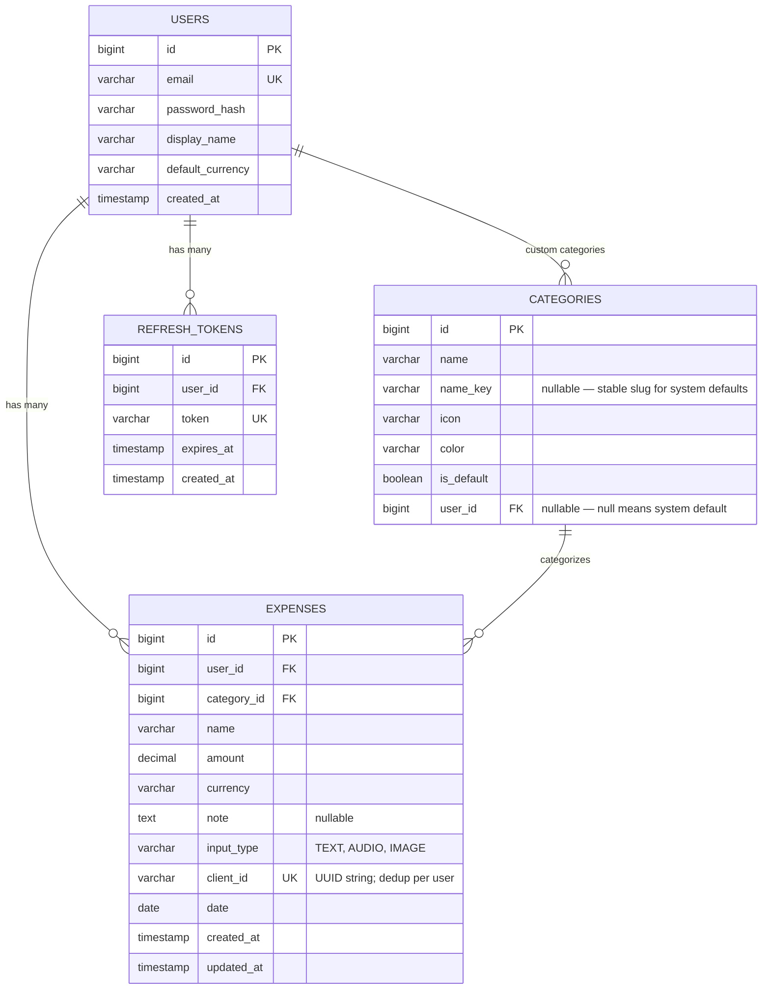
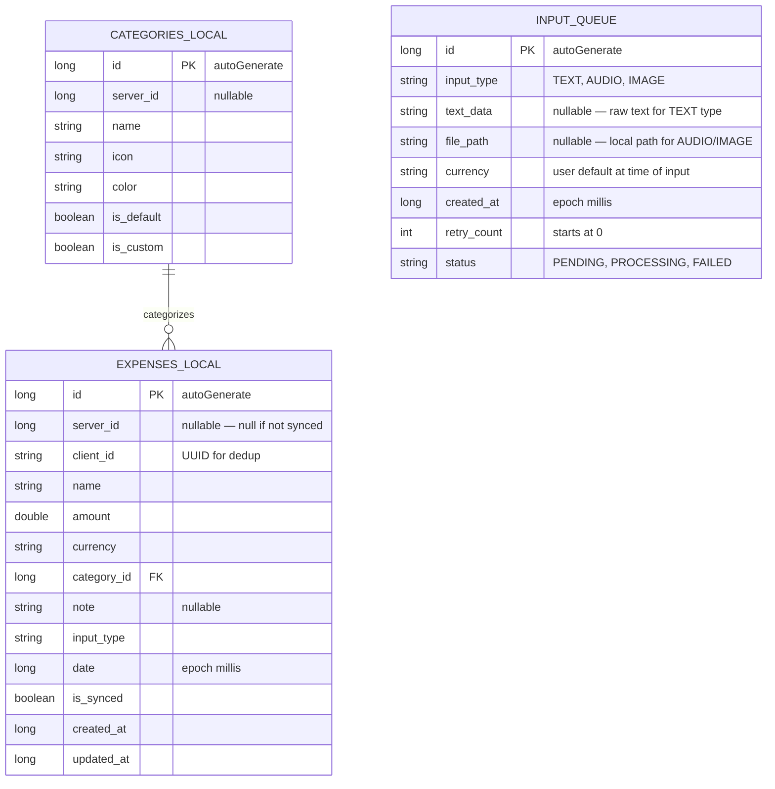

# Data Models

## Server Database Schema (PostgreSQL / Exposed)



### Table Details

#### users

| Column | Type | Constraints | Notes |
|--------|------|-------------|-------|
| id | bigint | PK, auto-increment | |
| email | varchar(255) | unique, not null | |
| password_hash | varchar(255) | not null | BCrypt hash |
| display_name | varchar(100) | not null | |
| default_currency | varchar(3) | not null, default "UAH" | ISO 4217 code |
| created_at | timestamp | not null, default now() | |

#### categories

| Column | Type | Constraints | Notes |
|--------|------|-------------|-------|
| id | bigint | PK, auto-increment | |
| name | varchar(100) | not null | Display fallback (English for seeded rows); API may override using `name_key` + `Accept-Language` |
| name_key | varchar(32) | nullable | Stable key for seeded system rows (`food`, `transport`, …); null for user-created categories |
| icon | varchar(50) | not null | Prefixed icon: "material:restaurant" or "emoji:💪" |
| color | varchar(7) | not null | Hex color, e.g. "#4CAF50" |
| is_default | boolean | not null, default false | System-provided category |
| user_id | bigint | FK → users, nullable | null = system default, set = user-created |

#### expenses

| Column | Type | Constraints | Notes |
|--------|------|-------------|-------|
| id | bigint | PK, auto-increment | |
| user_id | bigint | FK → users, not null | |
| category_id | bigint | FK → categories, not null | |
| name | varchar(255) | not null | |
| amount | decimal(12,2) | not null | |
| currency | varchar(3) | not null | ISO 4217 code |
| note | text | nullable | Optional user note |
| input_type | varchar(10) | not null | TEXT, AUDIO, or IMAGE |
| client_id | uuid | unique, not null | Generated by client for offline sync dedup |
| date | date | not null | Expense date (kotlinx-datetime LocalDate) |
| created_at | timestamp | not null, default now() | |
| updated_at | timestamp | not null, default now() | |

#### refresh_tokens

| Column | Type | Constraints | Notes |
|--------|------|-------------|-------|
| id | bigint | PK, auto-increment | |
| user_id | bigint | FK → users, not null | |
| token | varchar(512) | unique, not null | |
| expires_at | timestamp | not null | 90-day expiry |
| created_at | timestamp | not null, default now() | |

---

## Client Database Schema (Room KMP)



### Table Details

#### expenses (local)

| Column | Type | Notes |
|--------|------|-------|
| id | long | autoGenerate PK |
| server_id | long? | null until synced with server |
| client_id | string | UUID, matches server's client_id for dedup |
| name | string | |
| amount | double | |
| currency | string | ISO 4217 |
| category_id | long | FK to local categories table |
| note | string? | |
| input_type | string | TEXT, AUDIO, IMAGE |
| date | long | Epoch milliseconds |
| created_at | long | Epoch milliseconds |
| updated_at | long | Epoch milliseconds |

#### categories (local)

| Column | Type | Notes |
|--------|------|-------|
| id | long | autoGenerate PK |
| server_id | long? | null until synced |
| name | string | |
| icon | string | Material icon name |
| color | string | Hex color |
| is_default | boolean | System-provided |
| is_custom | boolean | User-created |

#### input_queue

Stores raw user input waiting to be sent to the server for AI parsing when back online.

| Column | Type | Notes |
|--------|------|-------|
| id | long | autoGenerate PK |
| input_type | string | TEXT, AUDIO, or IMAGE |
| text_data | string? | Raw text input (for TEXT type) |
| file_path | string? | Local file path to audio/image (for AUDIO/IMAGE types) |
| currency | string | User's default currency at time of input |
| created_at | long | Epoch millis — preserves when the expense actually happened |
| retry_count | int | Incremented on failure, starts at 0 |
| status | string | PENDING, PROCESSING, FAILED |

---

## Shared DTOs (`:core`)

### Auth

```
LoginRequest(email: String, password: String)
RegisterRequest(email: String, password: String, displayName: String)
AuthResponse(token: String, refreshToken: String, user: UserDto)
UserDto(id: Long, email: String, displayName: String, defaultCurrency: String)
RefreshRequest(refreshToken: String)
```

### Parsing

`ParseTextResponse` is the single response type for all three parse endpoints.
`transcript` is set only by `/parse/audio`, `rawText` only by `/parse/receipt`.

```
ParseTextRequest(text: String, currency: Currency)
ParsedExpenseItem(name: String, amount: Double, currency: Currency, suggestedCategoryId: Long?, suggestedCategoryName: String?, confidence: Double)
ParseTextResponse(items: List<ParsedExpenseItem>, transcript: String?, rawText: String?)
ParseModality { TEXT, AUDIO, RECEIPT }
ParseCorrectionRequest(modality: ParseModality, currency: Currency, original: List<ParsedExpenseItem>, final: List<ParsedExpenseItem>)
```

### Expenses

```
ExpenseRequest(name: String, amount: Double, currency: Currency, categoryId: Long, note: String?, inputType: InputType, clientId: String, date: LocalDate)
ExpenseResponse(id: Long, name: String, amount: Double, currency: Currency, category: CategoryDto, note: String?, inputType: InputType, date: LocalDate, createdAt: Instant)
ExpenseListResponse(items: List<ExpenseResponse>, total: Int, page: Int, size: Int)
```

### Categories

```
CategoryDto(id: Long, name: String, icon: String, color: String, isDefault: Boolean, nameKey: String?)
CreateCategoryRequest(name: String, icon: String, color: String)
```

For system defaults, `nameKey` is a stable slug (see `:core` `DefaultCategoryKeys`); `name` is localized from `DefaultCategoryTranslations` using the HTTP `Accept-Language` header (`en` and `uk` supported; anything else falls back to English).

### Analytics

`/analytics/breakdown` returns a bare `List<CategoryBreakdownItem>`. `/analytics/monthly`
and `/analytics/trend` return the wrapper types below.

```
MonthlySummaryResponse(year: Int, month: Int, currency: Currency, grandTotal: Double, totalByCategory: List<CategoryTotal>)
CategoryTotal(category: String, amount: Double)
CategoryBreakdownItem(category: String, amount: Double, percentage: Double, count: Int)
TrendResponse(granularity: TrendGranularity, points: List<TrendPoint>)
TrendPoint(year: Int?, month: Int?, weekStart: LocalDate?, total: Double)
TrendGranularity { WEEKLY, MONTHLY }
```

### Domain Types

```
enum Currency(code: String, symbol: String) { UAH, USD, EUR, GBP }
enum InputType { TEXT, AUDIO, IMAGE }
```

### Validation

Request validation runs on the server. Route handlers call validator functions in `server/src/main/kotlin/com/vstorchevyi/skilky/security/` (`Validators.kt`, `ExpenseValidators.kt`, `ParseValidators.kt`); a failed check throws `ValidationException`, which the `StatusPages` plugin maps to a 422. The `:core` module holds the DTOs but not the validation logic, so the rules below are enforced server-side only.

| Field | Rule |
|-------|------|
| Email | Valid format (RFC 5322 simplified), max 254 chars |
| Password | Min 8 chars, at least 1 letter + 1 digit |
| Display name | 1–100 chars, trimmed |
| Expense amount | > 0, max 12 digits |
| Category name | 1–100 chars |
| Category color | Valid hex (#RRGGBB) |

---

## Default Categories

Each row is seeded with `name_key` and English `name`; the API returns localized `name` for `en` / `uk` via `Accept-Language` (see `DefaultCategoryTranslations` in `:core`).

| name_key | English | Ukrainian | Icon | Color | Description |
|----------|---------|-----------|------|-------|-------------|
| food | Food | Їжа | material:restaurant | #4CAF50 | Groceries, restaurants, coffee |
| transport | Transport | Транспорт | material:directions_car | #2196F3 | Taxi, fuel, public transport |
| housing | Housing | Житло | material:home | #9C27B0 | Rent, utilities, maintenance |
| entertainment | Entertainment | Розваги | material:movie | #E91E63 | Movies, games, events |
| health | Health | Здоров'я | material:medical_services | #F44336 | Pharmacy, doctor, gym |
| shopping | Shopping | Покупки | material:shopping_bag | #FF9800 | Clothes, electronics, gifts |
| bills | Bills | Рахунки | material:receipt_long | #607D8B | Phone, internet, subscriptions |
| education | Education | Освіта | material:school | #3F51B5 | Courses, books, supplies |
| other | Other | Інше | material:more_horiz | #795548 | Anything that doesn't fit above |

**Icon format:** Prefixed string. Defaults use `material:<icon_name>` (Material Icons, built into Compose). Custom categories use `emoji:<emoji>` (user picks from emoji picker).
