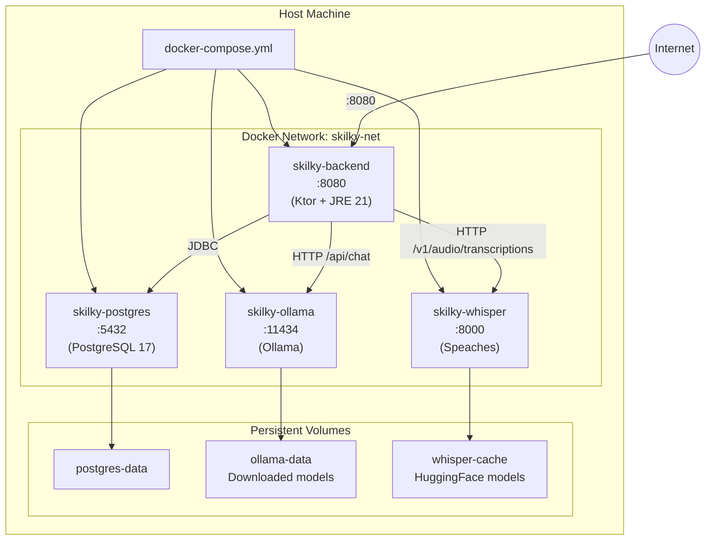
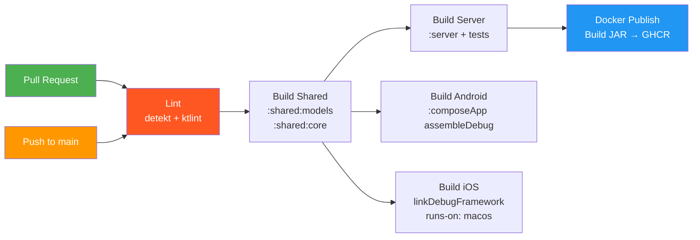

# Deployment & Self-Hosting

## Docker Architecture



## Docker Compose Services

| Service | Image | Port | Volume | Depends On |
|---------|-------|------|--------|-----------|
| **postgres** | postgres:17-alpine | 5432 | postgres-data | — |
| **ollama** | ollama/ollama:latest | 11434 | ollama-data | — |
| **whisper** | speaches:latest-cpu | 8000 | whisper-cache | — |
| **backend** | skilky-backend (custom) | 8080 | — | postgres, ollama, whisper |

### Health Checks

- **postgres:** `pg_isready -U skilky` (5s interval, 3 retries)
- **ollama:** `curl -f http://localhost:11434/` (10s interval, 5 retries)
- **whisper:** `curl -f http://localhost:8000/health` (10s interval, 5 retries)
- **backend:** starts only after all dependencies are healthy

## Environment Variables

| Variable | Default | Required | Description |
|----------|---------|----------|-------------|
| `POSTGRES_DB` | skilky | No | Database name |
| `POSTGRES_USER` | skilky | No | Database user |
| `POSTGRES_PASSWORD` | — | **Yes** | Database password |
| `POSTGRES_PORT` | 5432 | No | Exposed port |
| `JWT_SECRET` | — | **Yes** | Secret for JWT signing |
| `JWT_ISSUER` | skilky-tracker | No | JWT issuer claim |
| `JWT_AUDIENCE` | skilky-users | No | JWT audience claim |
| `OLLAMA_TEXT_MODEL` | llama3.2 | No | Model for text parsing |
| `OLLAMA_VISION_MODEL` | llava | No | Model for receipt scanning |
| `WHISPER_MODEL` | Systran/faster-whisper-small | No | Whisper model size |
| `BACKEND_PORT` | 8080 | No | Exposed backend port |
| `OLLAMA_PORT` | 11434 | No | Exposed Ollama port |
| `WHISPER_PORT` | 8000 | No | Exposed Whisper port |

## Self-Hosting Quick Start

### Prerequisites

- Docker & Docker Compose installed
- 8 GB RAM minimum (Ollama needs memory for models)
- 10 GB disk space (for models and database)

### Steps

1. **Get the files:**
   ```bash
   # Clone the repo (or just download docker/ directory)
   git clone https://github.com/user/skilky-money-tracker.git
   cd skilky-money-tracker/docker
   ```

2. **Configure:**
   ```bash
   cp .env.example .env
   # Edit .env — set POSTGRES_PASSWORD and JWT_SECRET
   ```

3. **Start everything:**
   ```bash
   docker compose up -d
   ```

4. **Pull AI models (first time only):**
   ```bash
   # Text parsing model
   docker exec skilky-ollama ollama pull llama3.2

   # Receipt vision model
   docker exec skilky-ollama ollama pull llava
   ```

   Whisper model downloads automatically on first use.

5. **Use the app:**
   - Open the mobile app
   - Go to Settings → Server URL → enter `http://<your-server-ip>:8080`
   - Register an account
   - Start tracking

### GPU Acceleration (Optional)

For faster AI processing, uncomment the GPU section in `docker-compose.yml`:

```yaml
ollama:
  deploy:
    resources:
      reservations:
        devices:
          - driver: nvidia
            count: 1
            capabilities: [gpu]
```

Requires NVIDIA Container Toolkit installed on the host.

## Backend Dockerfile

The Ktor server is packaged as a fat JAR using the `buildFatJar` Gradle task:

```dockerfile
FROM eclipse-temurin:21-jre-alpine
WORKDIR /app
COPY server/build/libs/server-all.jar /app/server.jar
EXPOSE 8080
ENTRYPOINT ["java", "-jar", "/app/server.jar"]
```

Build process: CI builds the JAR → Docker image wraps it → push to GHCR.

## System Requirements

### Minimum (CPU-only AI)

| Resource | Amount |
|----------|--------|
| RAM | 8 GB |
| Disk | 10 GB |
| CPU | 4 cores |

### Recommended (with GPU)

| Resource | Amount |
|----------|--------|
| RAM | 16 GB |
| Disk | 20 GB |
| GPU | NVIDIA with 6+ GB VRAM |
| CPU | 4+ cores |

---

## CI/CD Pipeline



### Jobs

| Job | Runner | Trigger | What it does |
|-----|--------|---------|-------------|
| **lint** | ubuntu | PR + push to main | Detekt (static analysis) + Ktlint (formatting) on all modules |
| **build-shared** | ubuntu | PR + push to main | Build & test :shared:models and :shared:core |
| **build-server** | ubuntu | PR + push to main | Build & test :server, build fat JAR |
| **build-android** | ubuntu | PR + push to main | assembleDebug + unit tests |
| **build-ios** | macos | PR + push to main | linkDebugFrameworkIosSimulatorArm64 |
| **docker-publish** | ubuntu | push to main only | Build fat JAR → Docker image → push to GHCR |

### Dependencies

- lint runs first — PRs with lint failures won't proceed to build
- build-server, build-android, build-ios all depend on lint + build-shared
- docker-publish depends on build-server
