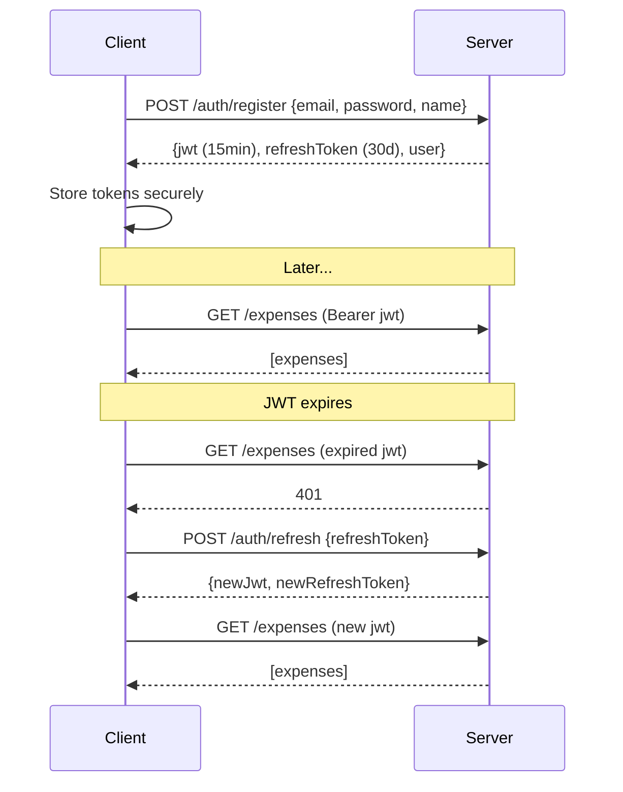

# F09: Authentication System

**Priority:** MVP
**Phase:** 2

## Summary

Email/password authentication with JWT tokens. Same system works for both the hosted service and self-hosted instances. Supports multi-device access.

## User Stories

- As a user, I want to create an account so my data is saved securely
- As a user, I want to stay logged in across app restarts
- As a user, I want to access my data from multiple devices

## Auth Flow

## Token Details

| Token | Lifetime | Storage | Contains |
|-------|----------|---------|----------|
| JWT | 7 days | DataStore | userId, email, iat, exp |
| Refresh Token | 90 days | DataStore | Random UUID |

- JWT is longer-lived (7 days) — appropriate for a personal budgeting app, avoids constant refresh calls
- Refresh tokens rotate on each use (old one invalidated)
- Multiple refresh tokens allowed per user (multi-device)
- Password change invalidates all refresh tokens (kills all sessions)

## Token Storage

**DataStore (Preferences)** — KMP-native, works on Android + iOS with shared code. No expect/actual needed.

No encryption for MVP — DataStore files live in the app's private sandbox (other apps can't read them), and iOS encrypts app data at rest. Encryption can be added as a wrapper later if needed.

## Auto-Refresh

The Ktor Client `AuthInterceptor`:
1. Attaches `Authorization: Bearer <jwt>` to every request
2. On 401 response, calls `/auth/refresh` with refresh token
3. Stores new tokens, retries original request
4. If refresh fails → logout → redirect to Login screen

## Hosted vs Self-Hosted

Same auth system. Differences:
- **Hosted:** multiple users, standard registration
- **Self-hosted:** user creates one account during setup. Same JWT flow means multi-device works.
- **Server URL:** configurable in Settings (default: hosted server, changeable to self-hosted IP)

## Screens

### Login
- Email field
- Password field
- "Login" button
- "Create account" link → Register screen
- Error display (invalid credentials)

### Register
- Email field
- Password field (with strength indicator)
- Display name field
- "Create account" button
- Auto-login after successful registration

## Validation

- Email: valid format, unique
- Password: minimum 8 characters
- Display name: 1-100 characters
- All validation runs on both client (immediate feedback) and server (enforcement)

## Acceptance Criteria

- [ ] Register new account → auto-login → see Home
- [ ] Login with existing credentials → see Home
- [ ] Invalid credentials → error message
- [ ] Close app → reopen → still logged in
- [ ] JWT expires → auto-refresh without user interaction
- [ ] Refresh token expires → redirect to Login
- [ ] Same account works on multiple devices
- [ ] Server URL configurable in Settings
