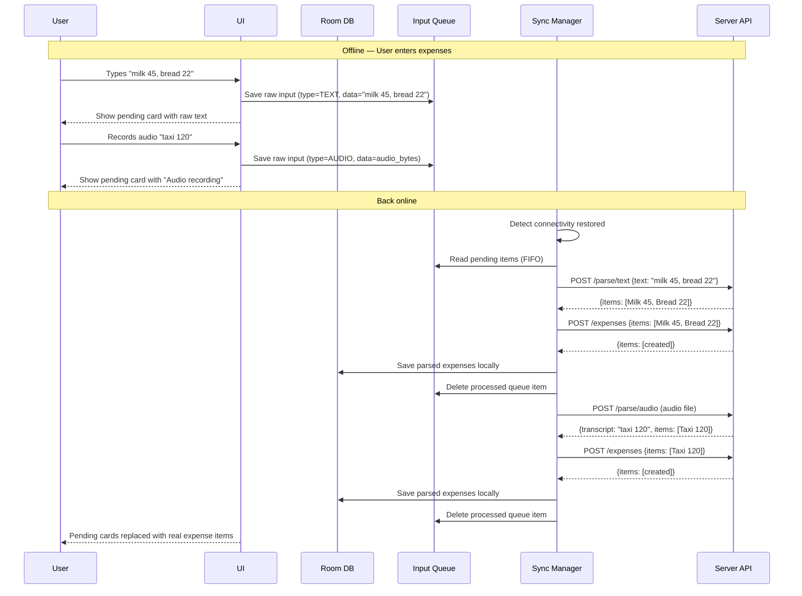

# F10: Offline Queue

**Priority:** MVP
**Phase:** 6
**Depends on:** F01 (Quick Text Entry), F05 (Expense CRUD)

## Summary

The app works without internet. Users can still enter expenses via text, audio, or image. Raw input is queued locally and sent to the server for AI parsing when connectivity returns. Parsed results are auto-saved without requiring the user to review a backlog.

## User Story

As a user, I want to log expenses even when I have no internet so I never forget a purchase.

## Key Insight

AI parsing happens on the server (Ollama/Whisper). When offline, the client only has **raw input** (text string, audio bytes, receipt image) — not structured expense data. The offline queue stores raw input, not parsed expenses.

## How It Works



## Components

### InputQueue (Room table)

Stores raw user input waiting to be parsed by the server.

| Column | Type | Notes |
|--------|------|-------|
| id | long | autoGenerate PK |
| input_type | string | TEXT, AUDIO, IMAGE |
| text_data | string? | Raw text input (for TEXT type) |
| file_path | string? | Local file path to audio/image (for AUDIO/IMAGE types) |
| currency | string | User's default currency at time of input |
| created_at | long | Epoch millis — preserves when the expense actually happened |
| retry_count | int | Incremented on failure, starts at 0 |
| status | string | PENDING, PROCESSING, FAILED |

### NetworkMonitor (expect/actual)
- **Android:** ConnectivityManager + NetworkCallback
- **iOS:** NWPathMonitor
- Emits connectivity state as a Flow

### SyncManager
- Observes NetworkMonitor
- When online: processes input queue FIFO
- For each queued item:
  1. Send raw input to appropriate `/parse/*` endpoint
  2. Take parsed result → send to `POST /expenses` (with `clientId` for dedup)
  3. Save parsed expenses to local Room DB
  4. Delete queue item
- On failure: increment retry_count, leave in queue
- Max retries: 5 (then mark as FAILED for manual review)
- On app launch (online): process queue + pull latest expenses from server

## Auto-Save (No Backlog Review)

When the queue is processed, parsed items are **saved automatically** using AI-suggested categories. The user is NOT interrupted with a preview backlog.

Why: Forcing the user to review 10 previews when they come back online defeats the "lazy" UX. Instead:
- AI does its best
- Items appear in the expense list like normal
- User can review and edit anytime at their own pace
- If AI confidence is low, the expense could show a subtle "review suggested" indicator

## UI for Pending Items

While offline, queued items appear in the expense list as **pending cards**:

```
│  ☁↑ "milk 45, bread 22"       Pending   │
│  ☁↑ Audio recording            Pending   │
│  ☁↑ Receipt photo              Pending   │
│  ── Synced ────────────────────────────  │
│  🍽 Yesterday's lunch     120.00 ₴       │
```

- Text input: shows the raw text
- Audio input: shows "Audio recording" + duration
- Image input: shows receipt thumbnail
- All have a cloud-upload icon (☁↑) and "Pending" label
- Once processed, they're replaced with normal expense cards

## Failed Items

If an item fails after 5 retries:
- Marked as FAILED
- Shows "Failed to process" with retry button
- User can tap to retry or delete
- For text: user can edit the raw text before retrying

## Deduplication

- `POST /expenses` uses `clientId` (UUID) for dedup
- Server has unique index on `client_id`
- Safe to retry: if the expense was already created, server returns existing item
- This prevents duplicates if the app retries after a network drop mid-sync

## What Offline Does NOT Support

- **Editing existing expenses** — requires server round-trip. Edit operations are queued separately (simpler: just block editing with "You're offline" message for MVP).
- **Analytics** — show cached data only, with "Offline — data may not be current" indicator
- **Category management** — requires server. Block with offline message.

## Acceptance Criteria

- [ ] Offline → type text → pending card appears in list
- [ ] Offline → record audio → pending card appears
- [ ] Offline → take receipt photo → pending card with thumbnail appears
- [ ] Go online → pending items processed automatically
- [ ] Pending cards replaced with real expense items
- [ ] Correct categories assigned by AI
- [ ] No duplicate expenses after retries
- [ ] Failed items show retry option
- [ ] App launch (online) triggers queue processing
- [ ] Raw text/audio/image files cleaned up after successful processing
